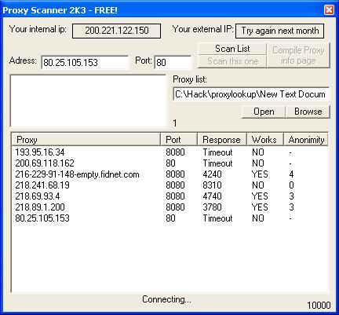



## Proxy Scanner\(analyzer\)

### Description

This prog. analyses proxies and scans them. It works almost great! it also gets your real ip, and checks for the anonimity of the proxy. This is also called a Proxy checker, or Proxy analyzer!
 
### More Info
 

             |
---                |---
**Submitted On**   |2003-08-28 21:40:18
**By**             |[Master Spy](https://github.com/Planet-Source-Code/PSCIndex/blob/master/ByAuthor/master-spy.md)
**Level**          |Intermediate
**User Rating**    |5.0 (30 globes from 6 users)
**Compatibility**  |VB 5\.0, VB 6\.0
**Category**       |[Complete Applications](https://github.com/Planet-Source-Code/PSCIndex/blob/master/ByCategory/complete-applications__1-27.md)
**World**          |[Visual Basic](https://github.com/Planet-Source-Code/PSCIndex/blob/master/ByWorld/visual-basic.md)
**Archive File**   |[Proxy\_Scan1638688312003\.zip](https://github.com/Planet-Source-Code/master-spy-proxy-scanner-analyzer__1-48127/archive/master.zip)

